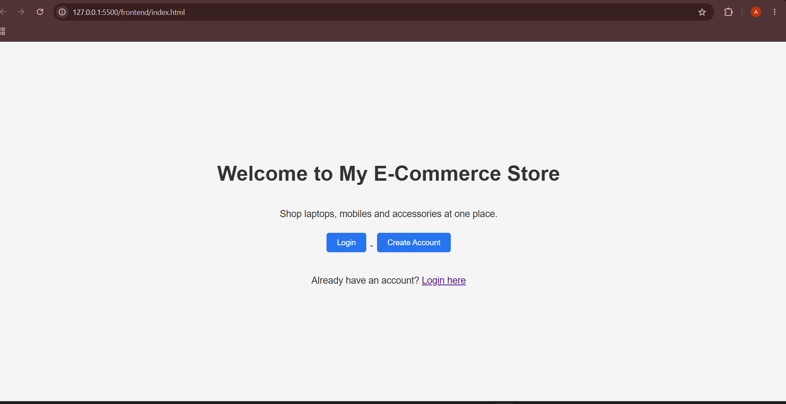
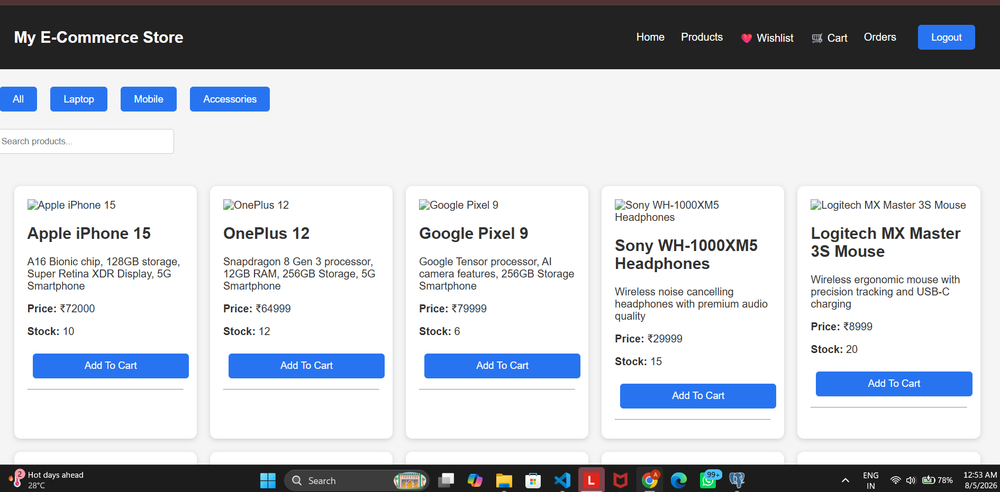
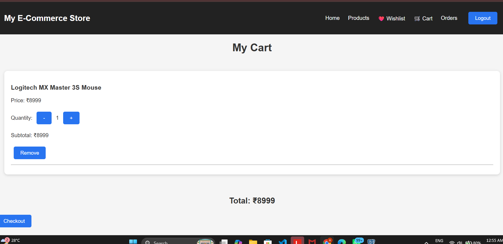
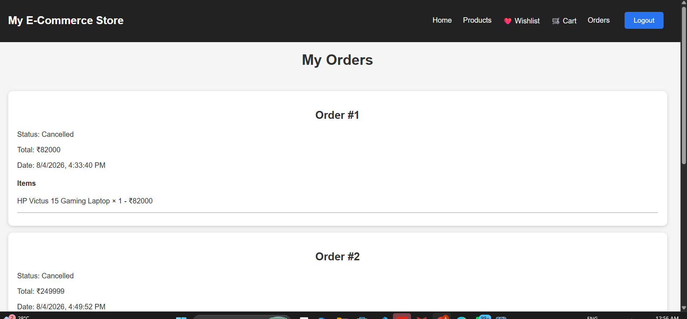

# E-Commerce Website

A full-stack e-commerce application built with FastAPI and JavaScript.

## Features

- User Authentication (JWT)
- Product browsing
- Category filtering
- Shopping cart
- Wishlist
- Orders
- Coupons
- Product reviews

## Tech Stack

Backend:
- FastAPI
- SQLAlchemy
- PostgreSQL
- JWT Authentication

Frontend:
- HTML
- CSS
- JavaScript

## Project Structure

fast_api_app/
frontend/

## How to Run

Backend:
uvicorn app.main:app --reload

Frontend:
Open index.html

## Screenshots

### Home Page

### Products Page

### Cart Page

### Orders Page

